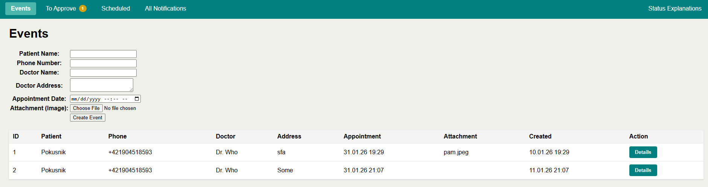
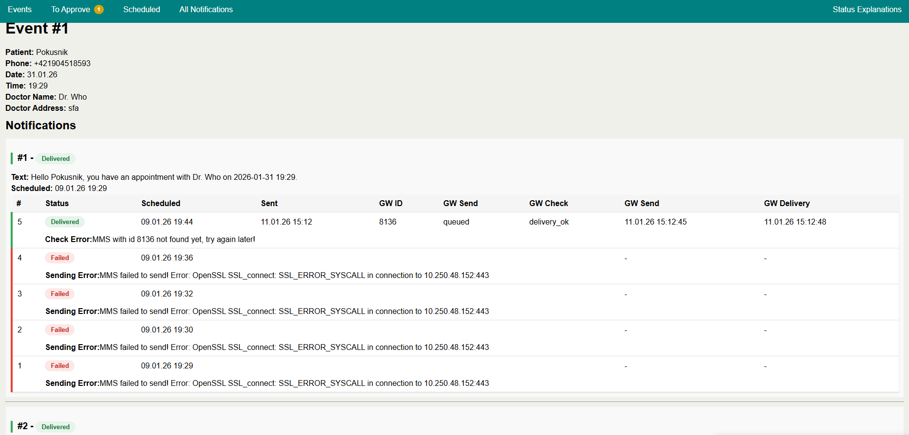

# SMS Gateway Demo

## Prerequisites

- Git installed
- Docker installed
- Docker is running

## Installation

Clone this repository, e.g.:
```bash
git clone https://github.com/gazdik/php-nette-playground.git
```

Navigate to the root:
```bash
cd php-nette-playground
```

**>>> NEW <<<**\
Create a file called `.env`, with the following content (but replace the placeholders with proper values):
```properties
SMS_GW_URL=https://<YOUR-GATEWAY-HOST>
SMS_GW_TOKEN=<YOUR-API-TOKEN>
```

Example:
```properties
SMS_GW_URL=https://10.20.30.40
SMS_GW_TOKEN=123456789AbCdEfGh
```

Build php-fpm image:
```bash
docker compose build php-fpm
```

Start the containers (in attached mode, i.e. stopping via Ctrl+C):
```bash
docker compose up
```

Open a new cmd/shell and again navigate to the root:
```bash
cd php-nette-playground
```

Install dependencies (PHP libraries):
```bash
docker compose exec -w /application/demo php-fpm composer install
```

If it works, the output should look like this:
```
Verifying lock file contents can be installed on current platform.
Package operations: 47 installs, 0 updates, 0 removals
  - Downloading symfony/thanks (v1.4.0)
  - Downloading latte/latte (v3.0.20)
  - Downloading nette/utils (v4.0.5)
...
 45/46 [===========================>]  97%
 46/46 [============================] 100%
Generating autoload files
24 packages you are using are looking for funding.
Use the `composer fund` command to find out more!
```

Verify Installation:

**>>> NEW <<<**\
The libraries are installed in the Docker itself, in a volume called `php-nette-playground_vendor`.
Check that there is a new folder `./demo/vendor` directory.

Ls command:
```
docker compose exec -w /application/demo php-fpm ls -la vendor
```

Expected output:
```bash
total 92
drwxr-xr-x 21 root root  4096 Jan  9 11:47 .
drwxr-xr-x  1 root root   512 Dec 28 17:03 ..
-rw-r--r--  1 root root   748 Jan  9 11:47 autoload.php
drwxr-xr-x  2 root root  4096 Jan  9 12:00 bin
drwxr-xr-x  2 root root 12288 Jan  9 11:47 composer
drwxr-xr-x  3 root root  4096 Jan  9 11:47 dibi
drwxr-xr-x  3 root root  4096 Jan  9 11:47 dragonmantank
drwxr-xr-x  3 root root  4096 Jan  9 11:47 latte
drwxr-xr-x  3 root root  4096 Jan  9 11:47 myclabs
drwxr-xr-x 19 root root  4096 Jan  9 11:47 nette
drwxr-xr-x  3 root root  4096 Jan  9 11:47 nextras
drwxr-xr-x  3 root root  4096 Jan  9 11:47 nikic
drwxr-xr-x 10 root root  4096 Jan  9 11:47 orisai
drwxr-xr-x  4 root root  4096 Jan  9 11:47 phar-io
drwxr-xr-x  8 root root  4096 Jan  9 11:47 phpunit
drwxr-xr-x  5 root root  4096 Jan  9 11:47 psr
drwxr-xr-x 15 root root  4096 Jan  9 11:47 sebastian
drwxr-xr-x  3 root root  4096 Jan  9 11:47 staabm
drwxr-xr-x 15 root root  4096 Jan  9 11:47 symfony
drwxr-xr-x  3 root root  4096 Jan  9 11:47 tharos
drwxr-xr-x  3 root root  4096 Jan  9 11:47 theseer
drwxr-xr-x  3 root root  4096 Jan  9 11:47 tracy
```

**>>> NEW <<<**\
Create DB tables:
```
docker compose exec -w /application/demo php-fpm php ./bin/console migrations:continue
```

Expected output:
```
Nextras Migrations
CONTINUE
1 migration needs to be executed.
- structures/2025-12-30-12-30-00_create_event_table.sql; 1 queries; 0.021 s
OK
```

## Usage

We are assuming your project is running, i.e. you called `docker compose up` and never stopped it.

Open: http://localhost:41000/event

Should see (with no data):



### Create events and send notifications manually

Enter a number in the format `+4219xyz`\
Enter Other stuff text.\
Add image with max 1MV\
Click `Create Event` create a message.\
This can be edited and finally approved on "To Approve".\
Manual Sending / Checking can be done on "Scheduled"\


For details with all messages and for each message all send attempts click "Details" (as the screnshot above) or click an `Event Id` on other pages.\
What you'll see:



### Enable automatic sending / checking

Uncomment the two commented out lines at the bottom of `docker-compose.yaml`:

```yaml
command: >
    /bin/sh -c "
    ...
    <UNCOMMENT THE NEXT TWO LINES>
    # echo '* * * * * /application/demo/bin/cron_scheduler.sh >> /application/demo/log/scheduler.log 2>&1' | crontab - &&
    # service cron start &&

    php-fpm8.4"

```

I'd only do this after it's clear manual process works.
Should work...

That's it.