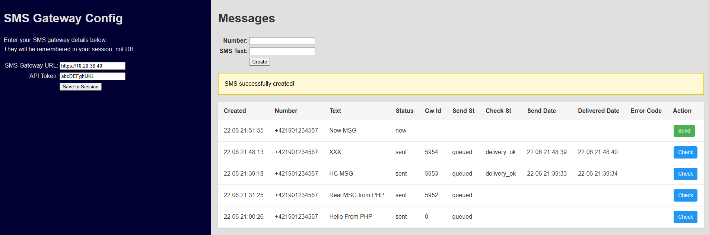

# SMS Gateway Demo

## Prerequisites

- Git installed
- Docker installed
- Docker is running

## Installation

Clone this repository, e.g.:
```bash
git clone https://github.com/gazdik/php-nette-playground.git
```

Navigate to the root:
```bash
cd php-nette-playground
```

Build php-fpm image:
```bash
docker compose build php-fpm
```

Start the containers (in attached mode, i.e. stopping via Ctrl+C):
```bash
docker compose up
```

Open a new cmd/shell and again navigate to the root:
```bash
cd php-nette-playground
```

Install dependencies (PHP libraries):
```bash
docker compose exec -w /application/demo php-fpm composer install
```

If it works, the output should look like this:
```
Verifying lock file contents can be installed on current platform.
Package operations: 47 installs, 0 updates, 0 removals
  - Downloading symfony/thanks (v1.4.0)
  - Downloading latte/latte (v3.0.20)
  - Downloading nette/utils (v4.0.5)
...
 45/46 [===========================>]  97%
 46/46 [============================] 100%
Generating autoload files
24 packages you are using are looking for funding.
Use the `composer fund` command to find out more!
```

Verify Installation:
Check that there is a new folder `./demo/vendor`, with a content like this:
```
demo/vendor/
├── bin/
├── composer/
├── dibi/
├── ...
├── trac/
└── autoload.php
```


## Usage

We are assuming your project is running, i.e. you called `docker compose up` and never stopped it.

Open: http://localhost:41000/sms

Should see (with no data):



### Configure the Gateway

First, enter `SMS Gateway URL` and `API Token` in the form ON THE LEFT and click `Save to Session`.

It's IMPORTANT to enter `https://` with the IP address.


### Send some SMS

Enter a number in the format `+4219xyz`\
Enter SMS text.\
Click `Create` to save the message to the database (nothing is sent yet).

Send the message with the green `Send` button.

Wait (hopefully only) a few seconds:\
Check the status with the blue `Check` button. \
If it works, it updates the `Check St`, `Send Date` and other columns on the right side.

That's it.

----

## Testing the Gateway via CLI

(Just in case....)

### Send MMS

Doc: https://www.smseagle.eu/docs/apiv2/#tag/Send-messages/operation/Messages::mms_post

> NOTE: Using non-ASCII characters is problematic in GitBash, better save it in a file:

```bash
echo '{ 
            "to":["+421xyz"], 
            "text":"MMS text používajúci diakritiku", 
            "encoding":"unicode", 
            "validity":"max", 
            "send_after":"08:00", 
            "send_before":"21:00", 
            "test":false,
            "attachments": [ { "content_type": "image/png", "content": "iVBORw0KGgoAAAANSUhEUgAAACAAAAAgCAYAAABzenr0AAAABHNCSVQICAgIfAhkiAAAAAlwSFlzAAAA3QAAAN0BcFOiBwAAABl0RVh0U29mdHdhcmUAd3d3Lmlua3NjYXBlLm9yZ5vuPBoAAASKSURBVFiFvZdrbFNlGMf/z3vOabtrO1i7bg7ZprtEN/dBshi7qxgSjRE0RIkkk/jBeCHRRIiSCDF4wQTkkpgYwwcB94XgJQ5QMgy7sBkzMwlXgQFbYMmWrWNth1uv7+OHtaPtWnc6GE9yPpznfd7n9ztv3/fkFMyMe70AfKYq5DJq1AagKKW59wH+CADeu6WAG1Zk+DWV7gBYk6T2MQDrACxfkACAXQAccblGACwvVHHwXBVv35gnBUGqKvYB0ACUAdhqMtJVAJyVIaaFwHREQi+YAOwA4AZwHsCqRAJTfZXsPVPJ7QdKODdH9WkquQFwebFx+vP37HztRDnLC1WclSGmAaxjZqjQEczMRDQIwA/gNoCxRHUHfplAgVXFi03ZuNhaavihzW1oqslERbHRFKm5MeTH5L/SBOAcAH0CYYlviSgDwElmPp+o5q1XlgAATnRP4uZwAG+/unROzeHf3DAZqX/aKy+lJBCW2J0gvSw+oamEzbuGkZEmsP4FS8zYodYJr9fH30fuUxKIDiJSAGwjwsfvN+dKACIytvKpTAyerEC6ScTMuTzgw5UBnwnA4XsSIKIik4GOGAxUffCLZWL1M9lzanKylTm59t470FTyBII8EMmJOVXzw2tUhS7WVKVXX2ot0xLBk8XaVWaYsxSTouCrBQsoCj59vj5TOfVdiVZg01Kaa81RcWTPwwaW2EhEaxYkAGDo73+8suXYBMZdoZQnN6zIwCfv5kFTqYWIiij8MtEdRGTWFHwJQa+FgpxV80R6YO0qs+GlZ7NR/JBBVw8pgZVv3Aj8eXaqI2WBKJEKIuqzWHKMAb8v5PVNaZePlVFJoT6JfS1ObN454l7oKXhUCNFlt+VrDkeDIoRQjv/6s/+n3z2GTRtyY2o/2Dks9xx0Jvupv05ZIAz/w27LtzgcDZoQAlJKaAaj8mOb279pQ+7sEhzt8GDvIScANAO4FdfqFjNfT0mAiEqFED02mz3H4WhQI/Cens6AyzUR+MvFaeOuEJZaFIw4g2j+aCjAjB3Md9988aH7FETD6xyNMfCR0WEXMz+pqDR5vMsDZmD9hzcDPr88C2B7VI/niOjNmL56NuFdeL6lLmrZT/d0BEdHRyaklE8z8zWDSt/kWbXXa6rSROupyVAwxI8z82BUHxOANGae0C1ARGVCiG6bzW6pczQmhYdrzYqC3QAKQyFsZebeeR/u/wSSwzsDo6PDLimlg5n7daxgGjNPJxpLugdm4VZ7/LKnDAdwnYiW6xYIw3tsVrulrrZBE0KBlKEwfCQVeD6AfgD5AM4QUfW8AkRUHoabY+DdnRF4rR44ADDzMIB3wrfbMPM9GcuL3gNheLfVajfXx8PHZuFX9cDjHmo1gKPMLJMKzAN3h5c9Zfh8oYbhFUKIbmuuLTsa3tXdGRhbRDgw871fIoTotebasuvrmhLBa5n5ymLAAUAVQmzJsSzJioGfbg+MOUcXHQ7MnIKXS0vLDXFwz4OAA4BCRKWeSU+lpmlKX1+vf/y2c/JBwSNRKITYL4QYF0LsB1ByP/6y673+AxCehN81VdPyAAAAAElFTkSuQmCC"} ]
        }' > mms.json
```

```bash
curl -H "Content-Type: application/json" \
     -H "access-token: $TOKEN" \
     -X POST \
     --insecure \
     -d @mms.json \
     https://$SMS_GATEWAY_URL/index.php/api/v2/messages/mms
```


### Send Single SMS

Doc: https://www.smseagle.eu/docs/apiv2/#tag/Send-messages/operation/Messages::sms_single_post

```bash
curl -H "Content-Type: application/json" \
     -H "access-token: $TOKEN" \
     -X POST \
     --insecure \
     -d '{ 
            "to":"+421xyz", 
            "text":"Hello there", 
            "encoding":"unicode", 
            "flash":false, 
            "validity":"max", 
            "test":false
        }' \
     https://$SMS_GATEWAY_URL/index.php/api/v2/messages/sms_single
```

```json
[{
    "status": "queued",
    "message": "Hello there",
    "number": "+421xyz",
    "id": 654
}]
```

### Read Sent Message

Doc: https://www.smseagle.eu/docs/apiv2/#tag/Read-messages/operation/Messages::messages_get

ID is the id from the response when sending (e.g. `654`)

```bash
curl -H "Content-Type: application/json" \
     -H "access-token: $TOKEN" \
     -X GET \
     --insecure \
     "https://$SMS_GATEWAY_URL/index.php/api/v2/messages/sent?id_from=$ID&id_to=$ID"
```

```json
[{
    "id": 654,
    "number": "+421xyz",
    "text": "Hello there",
    "text_binary": "00....",
    "attachments": null,
    "udh": null,
    "smsc": "+421def",
    "class": 255,
    "encoding": "unicode",
    "folder_id": 3,
    "validity": "max",
    "sender_name": "remote",
    "modem_no": 1,
    "status": "delivery_ok",
    "error_code": null,
    "update_date": "2025-06-22T18:05:43+02:00",
    "insert_date": "2025-06-22T18:04:16+02:00",
    "sending_date": "2025-06-22T18:04:21+02:00",
    "delivery_date": "2025-06-22T18:05:42+02:00"
}]
```

Error codes: https://www.smseagle.eu/learn/cms-errors-explained/

Statuses:
- sending_ok_no_report
- sending_ok
- delivery_ok
- delivery_pending
- delivery_unknown
- delivery_failed
- sending_error
- reserved
- error

